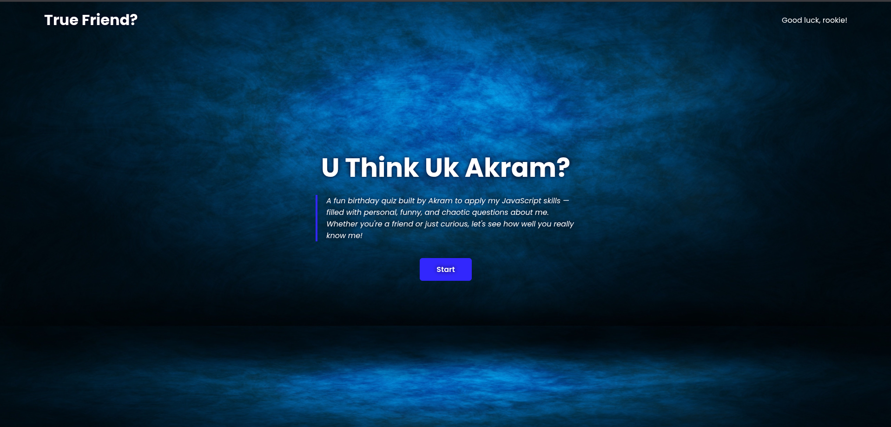
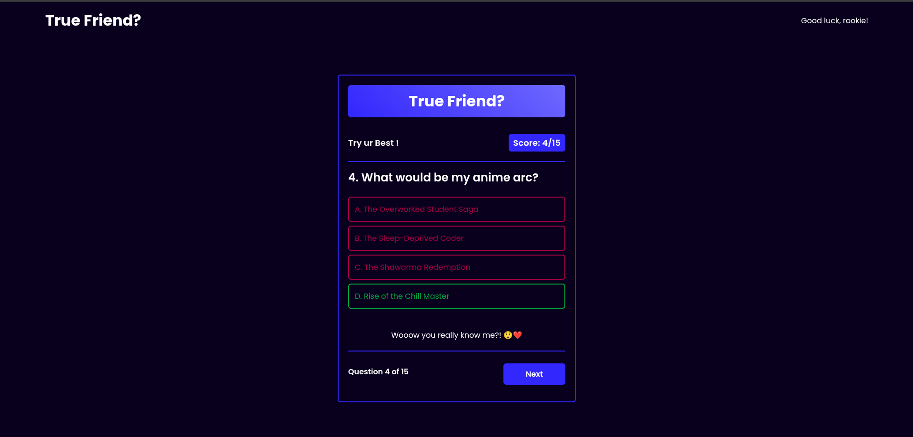
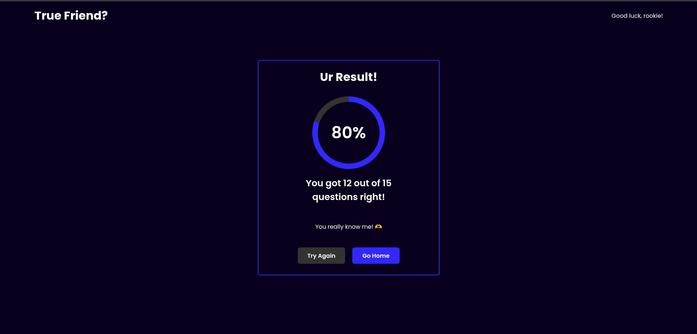

# True Friend Quiz - README

## 📝 Description
A fun interactive quiz built with HTML, CSS, and JavaScript to test how well your friends know you. This birthday-themed quiz features personal questions with humorous options and provides feedback based on the score.

## ✨ Features
- 15 personalized quiz questions
- Responsive design for all devices
- Animated transitions between sections
- Score-based feedback system
- Progress tracking during the quiz
- Visual percentage score display
- Random response messages for correct/incorrect answers
- Three difficulty tiers of final feedback

## 🛠️ Technologies Used
- HTML5
- CSS3 (with Flexbox)
- JavaScript (ES6)
- Google Fonts (Poppins)

## 🚀 How to Use
1. Clone this repository
2. Open `index.html` in your browser
3. Click "Start" to begin the quiz
4. Read each question and select the answer you think is correct
5. View your results at the end!

## 🎨 Customization
To personalize this quiz for yourself:
1. Edit `questions.js` to change the questions and answers
2. Modify the response arrays (`ukMe`, `udkMe`, etc.) with your own messages
3. Update the color scheme in the CSS (search for `#3227fd`)
4. Replace `bg-img.jpg` with your own background image

## 📱 Responsive Design
The quiz is fully responsive and works on:
- Mobile phones (tested down to 320px width)
- Tablets
- Desktop computers

## 📜 License
This project is open source and available.

---

Made with ❤️ by [Akram FERKIOUI] 
Happy quizzing! 🎉